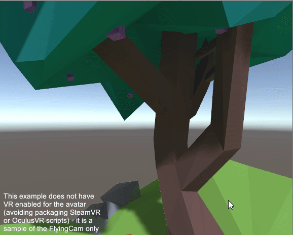

# VR Demo Pack

A simple way to show off your Unity developed PC VR application avoiding a the shaky first person view - have someone else control a 3rd person camera, viewing you as an avatar. You can use this for live or pre-recorded demonstrations.


## Get started

To use this, don't clone this repository, download the [Release](http://github.com/immersivecognition/vr-demo-pack/releases/latest) unity package.

## Binding the avatar

First we have to attach the avatar so that it is controlled by our head and hands. Begin by adding the `Avatar` prefab (`VRDemoPack/Prefabs` folder) to your scene.


We need to put make sure the Avatar prefab is on its own layer so that the Avatar is not seen by the player. Click add layer.


In layer 9 (or any free layer) enter a name (for example `InvisibleInHMD`).


Then click on our Avatar GameObject again make sure it is assigned (and all children if it asks) to the new `InvisibleInHMD` layer.


Now we find our VR camera, in this example its the Camera GameObject under the SteamVR CameraRig. This may vary depending on the VR SDK you are using. We Make sure in the Culling Mask the `InvisibleInHMD` layer is unchecked so that it doesn't show the objects from this layer.


Now we link up the Avatar to our tracked VR GameObjects. Expand the Avatar GameObject, and map the "Follow" field in the Transform Follower component to the corresponding tracked VR GameObject. The torso is set to loosely follow the head since we can't track the torso directly. For SteamVR, we will map it to the CameraRig GameObjects - it should look like this:

```
HeadParent TransformFollower Follow -> CameraRig Camera 
TorsoParent TransformFollower Follow -> CameraRig Camera 
LHandParent TransformFollower Follow -> CameraRig Controller (left)
RHandParent TransformFollower Follow -> CameraRig Controller (right)
```

For Oculus or other VR SDKs it it will be different but the HeadParent and TorsoParent should be following to the head, LHandParent to the Left Hand, and RHandParent to the Right Hand. 


Feel free to customise the Avatar!

## Setting up the flying camera

Just add the `FlyingCam` prefab (`VRDemoPack/Prefabs` folder) to your scene! By default it is setup such that pressing F1 enables the flying camera. Rendering the extra view will obviously incur increased rendering costs so make sure your PC can handle it!



## Credit

Island model made by Sebastian Böck: https://poly.google.com/view/1Cp7gi2Q8FL
